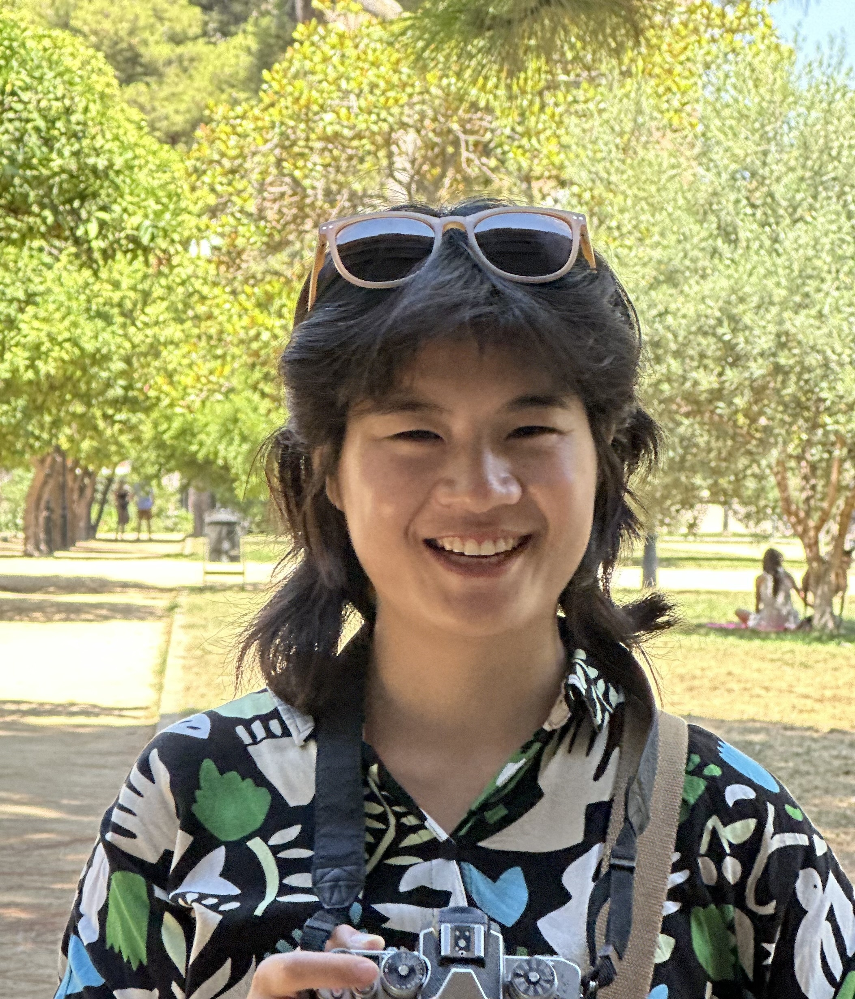
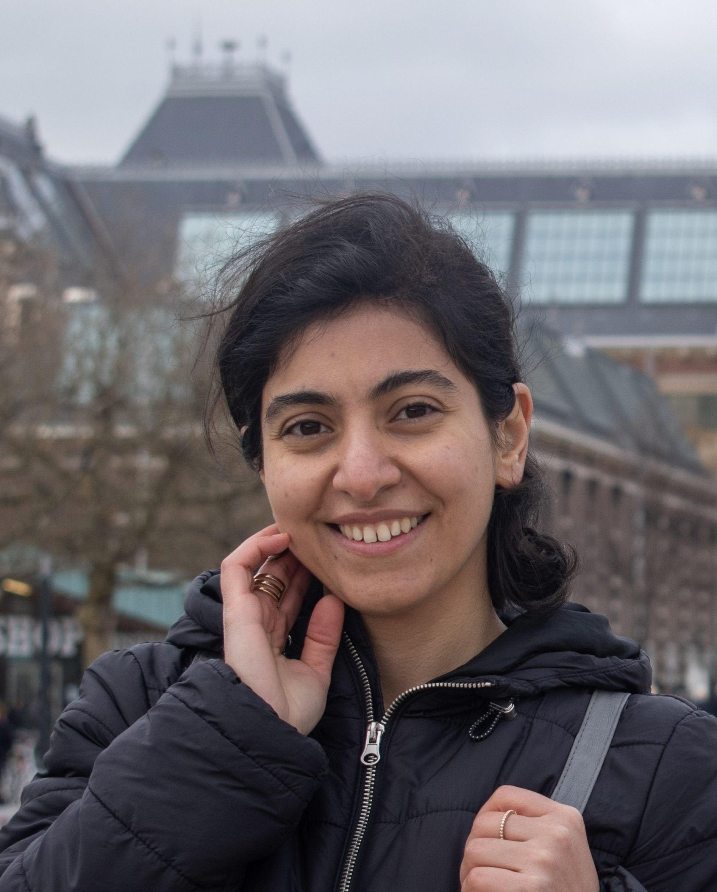
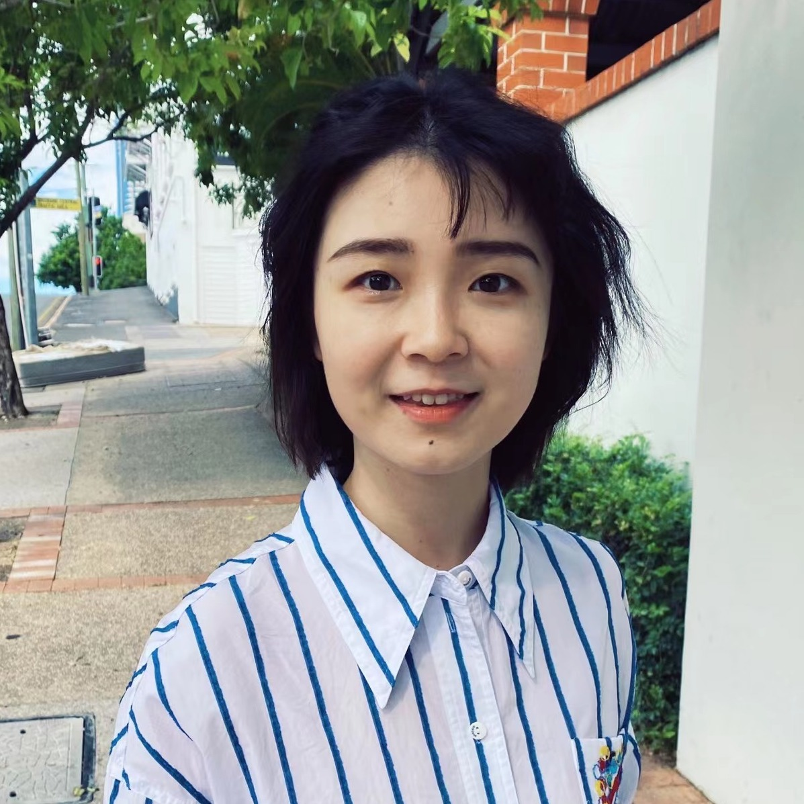
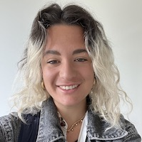
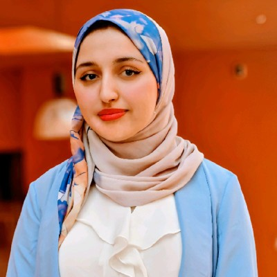

<table style="border: none; background: none; margin-top: 0;">
    <tr style="border: none; background: none;">
        <td colspan="3" style="border: none; background: none;">
        Faculty & Staff
        </td>
    </tr>
    <tr style="border: none; background: none;">
        <td style="border: none; background: none;">
             
            <a class="caption" href="http://pgroth.com">Prof. Paul Groth    Group Head   Full Professor </a>
        </td>
        <td style="border: none; background: none;">
             
            <a class="caption" href="https://fnack.wordpress.com/about/">Dr. Frank Nack   Senior Lecturer </a>
        </td>
        <td style="border: none; background: none;">
             
        <a class="caption" href="https://vdegeler.com">Dr. Victoria Degeler    Assistant Professor</a>
        </td>
    </tr>
    <tr style="border: none; background: none;"> 
        <td style="border: none; background: none;">
             
        <a class="caption" href="https://hazourahh.github.io/">Dr. Hazar Harmouch   Assistant Professor</a>
        </td>
        <td style="border: none; background: none;">
             
        <a class="caption" href="https://daphnemiedema.nl/">Dr. Daphne Miedema   Assistant Professor</a>
        </td>
        <td style="border: none; background: none;">
             
        <a class="caption" href="https://lisestork.github.io/">Dr. Lise Stork   Assistant Professor</a>
        </td>
    </tr>
    <tr style="border: none; background: none;">
        <td style="border: none; background: none;">
             
        <a class="caption" href="https://www.linkedin.com/in/jan-christoph-kalo-560283aa/">Dr. Jan-Christoph   Kalo    Assistant Professor</a>
        </td>
         <td style="border: none; background: none;">
             
            <a class="caption" href="https://www.linkedin.com/in/shubhaguha/">Shubha Guha   Research Engineer   & Data Steward </a>
        </td>
         <td style="border: none; background: none;">
             
            <a class="caption" href="https://nali001.github.io/aboutme/">Dr. Na Li   Postdoctoral   Researcher </a>
        </td>
    </tr>
    <tr style="border: none; background: none;">
        <td style="border: none; background: none;">
             
             <a class="caption" href="https://minaghadimi.github.io/">Mina Ghadimi Atigh   Postdoctoral   Researcher</a>
        </td>
        <td style="border: none; background: none;">
             
             <a class="caption" href="https://www.linkedin.com/in/francesco-compagno-34b80829a/">Dr. Francesco   Compagno  Postdoctoral   Researcher</a>
        </td>
    </tr>
    <tr style="border: none; background: none;">
        <td colspan="3" style="border: none; background: none;">
        PhD Students
        </td>
    </tr>
    <tr style="border: none; background: none;">
        <td style="border: none; background: none;">
             
            <a class="caption" href="https://pengyu-zhang.github.io/">Pengyu Zhang</a>
        </td>
        <td style="border: none; background: none;">
             
            <a class="caption" href="https://jantory.github.io/">Zeyu Zhang</a>
        </td>
        <td style="border: none; background: none;">
             
            <a class="caption" href="https://www.linkedin.com/in/finapolat/ ">Fina Polat</a>
        </td>
    </tr>
    <tr style="border: none; background: none;">
        <td style="border: none; background: none;">
             
            <a class="caption" href="https://erkankarabulut.github.io/">Erkan Karabulut</a>
        </td>
        <td style="border: none; background: none;">
             
            <a class="caption" href="https://danrux.github.io/">Danru Xu</a>
        </td>
         <td style="border: none; background: none;">
             
            <a class="caption" href="https://www.linkedin.com/in/teresa-liberatore-306755231/">Teresa Liberatore</a>
        </td>
    </tr>
    <tr style="border: none; background: none;">
        <td style="border: none; background: none;">
             
            <a class="caption" href="https://www.linkedin.com/in/yichun-wang-astrid/">Yichun Wang</a>
        </td>
        <td style="border: none; background: none;">
             
            <a class="caption" href="https://www.bradleypallen.org" >Bradley Allen</a>
        </td>
         <td style="border: none; background: none;">
             
             <a class="caption" href="https://davidjackson99.github.io/">David Jackson</a>
        </td>
    </tr>
    <tr style="border: none; background: none;">
        <td style="border: none; background: none;">
             
             <a class="caption" href="https://www.linkedin.com/in/lucas-lageweg-5022ba19b/">Lucas Lageweg</a>
        </td>
         <td style="border: none; background: none;">
             
             <a class="caption" href="https://www.linkedin.com/in/antonis-georgakopoulos-401925190">Antonis   Georgakopoulos</a>
        </td>
          <td style="border: none; background: none;">
             
             <a class="caption" href="https://imaneelghabi.github.io">Imane El Ghabi</a>
        </td>
    </tr>
    <tr style="border: none; background: none;">
     <td style="border: none; background: none;">
             
        <a class="caption" href="https://twitter.com/chrpr">Corey Harper</a>
        </td>
        <td style="border: none; background: none;">
             
        <a class="caption" href="https://www.linkedin.com/in/dmitrii-orlov/">Dmitrii Orlov</a>
        </td>
    </tr>
    <tr style="border: none; background: none;">
        <td colspan="3" style="border: none; background: none;">
        Guest Researchers
        </td>
    </tr>
    <tr style="border: none; background: none;">
         <td style="border: none; background: none;">
             
            <a class="caption" href="http://hartmutkoenitz.com">Dr. Hartmut Koenitz</a>
        </td>
        <td style="border: none; background: none;">
             
            <a class="caption" href="https://tdoehmen.github.io" >Till Döhmen</a>
        </td>
        <td style="border: none; background: none;">
             
            <a class="caption" href="https://klimzaporojets.github.io/ ">Klim Zaporojets</a>
        </td>
    </tr>
    <tr style="border: none; background: none;">
        <td style="border: none; background: none;">
             
        <a class="caption" href="https://thiviyansingam.com">Thiviyan   Thanapalasingam</a>
        </td>
    </tr>
</table>

 
 
 Previous Members & Guests
<ul>
<li> <a href="https://melika.xyz/">Melika Ayoughi</a> (UvA postdoc)</li>
<li> <a href="https://stefan-grafberger.com/">Stefan Grafberger</a> (Snowflake)</li>
<li><a  href="https://effyli.github.io">Effy Xue Li</a> (Postdoc - Centrum Wiskunde & Informatica (CWI)) </li>
<li><a href="https://www.linkedin.com/in/james-nevin-4b844b153/">Dr. James Nevin</a> (Postdoc Ichise Laboratory, Tokyo Institute of Technology)</li>
<li><a href="http://soiland-reyes.com/stian/about/">Dr. Stian Soiland-Reyes</a> (Senior Lecturer - University of Manchester)</li> 
<li><a href="https://bit.ly/MajidLotfianDelouee">Dr. Majid Lotfian Delouee</a> (Postdoc at Amsterdam UMC)</li>
<li><a href="https://www.linkedin.com/in/fan-feng-473b9120b/">Fan Feng</a> (City University of Hong Kong)</li>
<li><a href="https://dfdazac.github.io">Dr. Daniel Daza</a> (Postdoc at Amsterdam UMC)</li>
<li><a href="https://ssc.io">Prof. Sebastian Schelter</a> (Professor TU Berlin)</li>
<li><a href="https://www.uva.nl/profiel/s/a/j.a.c.sandberg/j.a.c.sandberg.html">Dr. Jacobijn Sandberg</a> (Retired) </li>
<li><a href="https://madelonhulsebos.github.io">Dr. Madelon Hulsebos</a> (Postdoctoral fellow at UC Berkeley) </li>
<li><a href="https://davidetalon.github.io/" >Dr. Davide Talon</a> (Italian Institute of Technology) </li>
<li><a href="https://profiles.uts.edu.au/SalvatoreFlavio.Pileggi" >Dr. Flavio Pileggi</a> (University of Technology Sydney) </li>
<li><a href="https://saramagliacane.github.io">Dr. Sara Magliacane</a> (Amsterdam Machine Learning Lab - UvA)</li>
<li><a href="http://www.ancaserbanescu.com/about/">Dr. Anca Serbanescu</a> (Politecnico di Milano)</li>
<li><a href="https://twitter.com/vale_carriero">Dr. Valentina Carriero</a> (University of Bologna)</li>
<li><a href="https://hannes.muehleisen.org">Dr. Hannes Mühleisen</a> (CWI & DuckDB labs)</li>
<li><a href="http://jizhang.pro">Dr. Ji Zhang</a> (Huawei) </li>
<li><a href="http://www.peterbloem.nl">Dr. Peter Bloem</a> (Vrije Universiteit Amsterdam) </li>
<li><a href="https://www.linkedin.com/in/valentin-vogelmann-a77b03198/">Valentin Vogelmann</a> (<a href="https://dhlab.nl">DHLab</a>)</li>
</ul>
