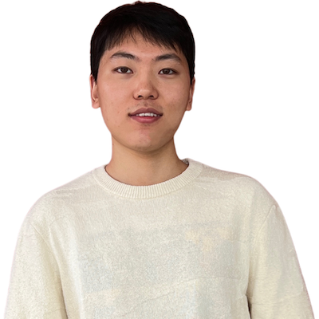

<table style="border: none; background: none; margin-top: 0;">
<tr style="border: none; background: none;">
    <td style="border: none; background: none;">
    Faculty & Staff
    </td>
</tr>
    <tr style="border: none; background: none;">
        <td style="border: none; background: none;">
             
            <a class="caption" href="http://pgroth.com">Prof. Paul Groth</a>
        </td>
        <td style="border: none; background: none;">
             
            <a class="caption" href="https://fnack.wordpress.com/about/">Dr. Frank Nack</a>
        </td>
        <td style="border: none; background: none;">
             
            <a class="caption" href="https://www.uva.nl/profiel/s/a/j.a.c.sandberg/j.a.c.sandberg.html">Dr. Jacobijn Sandberg</a>
        </td>
        </tr>
        <tr style="border: none; background: none;">
        <td style="border: none; background: none;">
             
        <a class="caption" href="https://ssc.io">Dr. Sebastian Schelter</a>
        </td>
        <td style="border: none; background: none;">
             
        <a class="caption" href="https://smaglia.wordpress.com">Dr. Sara Magliacane</a>
        </td>
        <td style="border: none; background: none;">
             
        <a class="caption" href="https://vdegeler.com">Dr. Viktoriya Degeler</a>
        </td>
    </tr>
    <tr style="border: none; background: none;">
        <td style="border: none; background: none;">
             
        <a class="caption" href="https://www.linkedin.com/in/shubhaguha/">Shubha Guha</a>
        </td>
    </tr>

    <tr style="border: none; background: none;">
        <td style="border: none; background: none;">
        PhD Students
        </td>
    </tr>
    <tr style="border: none; background: none;">
        <td style="border: none; background: none;">
             
        <a class="caption" href="https://thiviyansingam.com">Thiviyan   Thanapalasingam</a>
        </td>
        <td style="border: none; background: none;">
             
        <a class="caption" href="https://dfdazac.github.io">Daniel Daza</a>
        </td>
        <td style="border: none; background: none;">
             
        <a class="caption" href="https://madelonhulsebos.github.io">Madelon Hulsebos</a>
        </td>
         
    </tr>
    <tr style="border: none; background: none;">
        <td style="border: none; background: none;">
             
        <a class="caption" href="https://twitter.com/chrpr">Corey Harper</a>
        </td>  
        <td style="border: none; background: none;">
             
        <a class="caption" href="https://twitter.com/melikaayoughi">Melika Ayoughi</a>
        </td>
        <td style="border: none; background: none;">
             
        <a class="caption" href="https://effyli.github.io">Effy Xue Li</a>
        </td>
    </tr>
    <tr style="border: none; background: none;">
        <td style="border: none; background: none;">
             
        <a class="caption" href="http://soiland-reyes.com/stian/about/">Stian Soiland-Reyes</a>
        </td>
        <td style="border: none; background: none;">
             
        <a class="caption" href="https://www.linkedin.com/in/james-nevin-4b844b153/">James Nevin</a>
        </td>
        <td style="border: none; background: none;">
             
        <a class="caption" href="https://twitter.com/sgrafberger">Stefan Grafberger</a>
        </td>
    </tr>
    <tr style="border: none; background: none;">
    <td style="border: none; background: none;">
             
        <a class="caption" href="https://www.linkedin.com/in/pengyuzhang03/">Pengyu Zhang</a>
        </td>
    <td style="border: none; background: none;">
             
        <a class="caption" href="http://linkedin.com/in/zeyu-zhang-8b2416204">Zeyu Zhang</a>
        </td>
    </tr>
    <tr style="border: none; background: none;">
        <td colspan="3" style="border: none; background: none;">
        Guest Researchers
        </td>
    </tr>
    <tr style="border: none; background: none;">
        <td style="border: none; background: none;">
             
            <a class="caption" href="http://www.peterbloem.nl">Dr. Peter Bloem</a>
        </td>
        <td style="border: none; background: none;">
             
            <a class="caption" href="http://hartmutkoenitz.com">Dr. Hartmut Koenitz</a>
        </td>
        <td style="border: none; background: none;">
             
            <a class="caption" href="http://www.few.vu.nl/~schlobac/">Dr. Stefan Schlobach</a>
        </td>
        <td style="border: none; background: none; width:100px">
        </td>
    </tr>
    <tr style="border: none; background: none;">
        <td style="border: none; background: none;">
             
            <a class="caption" href="https://www.linkedin.com/in/fan-feng-473b9120b/">Fan Feng</a>
        </td>
    </tr>

 </table>

 
 
 Previous Members & Guests
<ul>
<li><a href="http://www.ancaserbanescu.com/about/">Anca Serbanescu</a> (Politecnico di Milano)</li>
<li><a href="https://twitter.com/vale_carriero">Valentina Carriero</a> (University of Bologna)</li>
<li><a href="https://hannes.muehleisen.org">Dr. Hannes Mühleisen</a> (CWI & DuckDB labs)</li>
<li><a href="http://jizhang.pro">Dr. Ji Zhang</a> (Huawei) </li>
<li><a href="https://www.linkedin.com/in/valentin-vogelmann-a77b03198/">Valentin Vogelmann</a> (<a href="https://dhlab.nl">DHLab</a>)</li>
</ul>
